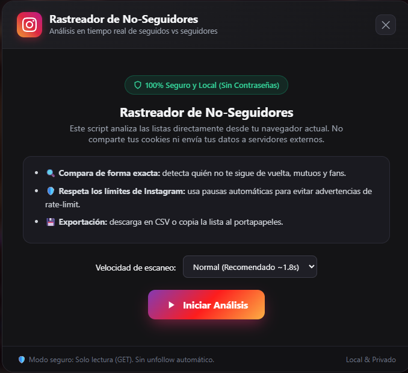

# Instagram Unfollowers Tracker

<p align="center">
  
</p>

<p align="center">
  Script sencillo para ver qué personas sigues en Instagram pero no te siguen de vuelta. Todo corre en tu propio navegador, sin pedir contraseñas ni enviar tus datos a ningún lado.
</p>

---

## Cómo usarlo

1. **Copia el script:** Abre [`instagram_unfollowers.js`](instagram_unfollowers.js) y copia el código (o dale al botón de copiar en la [web del proyecto](https://parzedxx.github.io/instagram-unfollowers-tracker/)).
2. **Entra a Instagram:** Abre [instagram.com](https://www.instagram.com) en tu navegador (**Brave, Chrome u Opera**) con tu cuenta iniciada.
3. **Abre la consola del navegador:**
   - En Windows: pulsa `F12` o `Ctrl + Shift + J`
   - En Mac: pulsa `Cmd + Option + J`
   - Ve a la pestaña **Consola** (o *Console*).
4. **Si te sale el aviso de seguridad del navegador:**
   Escribe esto en la consola y presiona Enter:
   ```text
   allow pasting
   ```
   *(si tu navegador está en español, pon `permitir pegar`)*.
5. **Pega el código:** Dale a `Ctrl + V` y presiona Enter.

Se abrirá una ventana dentro de Instagram donde puedes ver la lista, buscar usuarios y exportar los datos.

---

## Qué hace

- **No te siguen:** La lista de gente que sigues y no te devuelve el follow.
- **Mutuos:** Cuentas que se siguen mutuamente.
- **Fans:** Personas que te siguen pero tú no sigues.
- **Buscador:** Para filtrar rápido por nombre o usuario.
- **Copiar y exportar:** Puedes copiar los usuarios o bajarte un archivo CSV.
- **Pausas automáticas:** Hace pausas entre peticiones para que Instagram no te limite la cuenta.

---

## Creado por

Hecho por [ParZedxx](https://github.com/ParZedxx). Si te sirve o quieres mejorar algo, puedes dejar una estrella o abrir un pull request.
