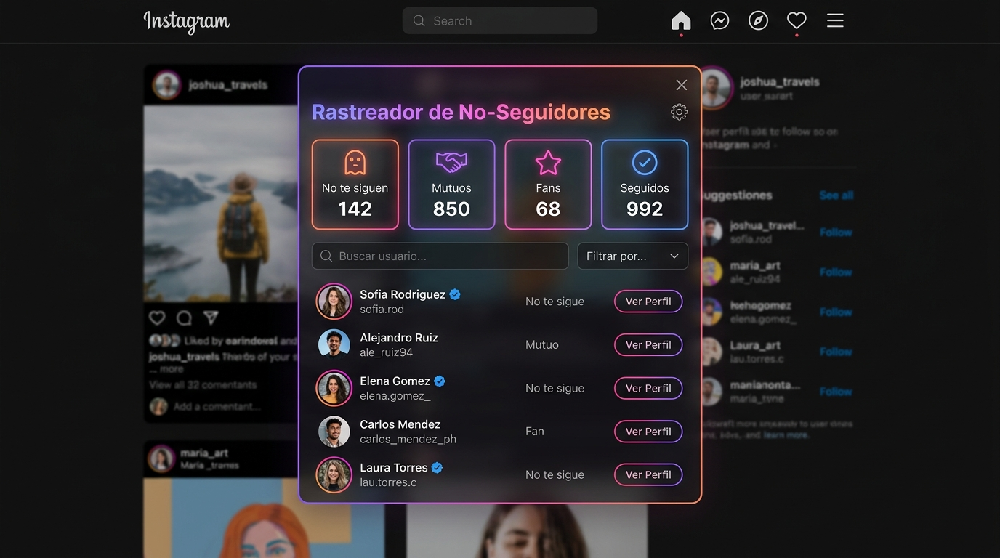

# 📸 Instagram Unfollowers Tracker

<p align="center">
  
</p>

<p align="center">
  <b>Descubre al instante qué cuentas sigues en Instagram pero no te siguen de vuelta.</b><br>
  100% seguro, local, sin necesidad de dar contraseñas ni instalar extensiones dudosas.
</p>

<p align="center">
  
  
  
</p>

---

## ⚡ 1. ¿Cómo usarlo en 30 segundos?

No necesitas descargar nada ni seleccionar miles de líneas de código.

1. **Copia el script:** Abre [`instagram_unfollowers.js`](instagram_unfollowers.js) o haz clic en el botón de copiar de nuestra [Página Web Interactiva](index.html).
2. **Entra en Instagram:** Abre [instagram.com](https://www.instagram.com) en tu navegador favorito (**Brave, Chrome u Opera**) habiendo iniciado sesión.
3. **Abre la consola de desarrollador:**
   - En Windows: Presiona <kbd>F12</kbd> o <kbd>Ctrl</kbd> + <kbd>Shift</kbd> + <kbd>J</kbd>
   - En Mac: Presiona <kbd>Cmd</kbd> + <kbd>Option</kbd> + <kbd>J</kbd>
   - Selecciona la pestaña **Consola** (*Console*).
4. **Desbloqueo de seguridad:** Si tu navegador muestra una advertencia en rojo (*"¡Detente!"* o *"Don't paste code"*), escribe:
   ```text
   allow pasting
   ```
   *(o `permitir pegar` en navegadores en español)* y pulsa <kbd>Enter</kbd>.
5. **Pega y ejecuta:** Pega el código con <kbd>Ctrl</kbd> + <kbd>V</kbd> y presiona <kbd>Enter</kbd>.
6. ¡Listo! Se abrirá un panel flotante oscuro con estadísticas en tiempo real.

---

## ✨ Características Principales

| Función | Descripción |
| :--- | :--- |
| ❌ **No te siguen de vuelta** | Detecta de forma instantánea a los usuarios que sigues pero no te siguen a ti. |
| 🤝 **Seguidores mutuos** | Cuentas con las que ambos se siguen mutuamente. |
| 🌟 **Fans** | Usuarios que te siguen a ti, pero tú no los sigues a ellos. |
| 🔍 **Buscador en Vivo** | Filtra rápidamente cualquier perfil por nombre de usuario o nombre completo. |
| 📋 **Copiar al Portapapeles** | Copia la lista completa de `@usuarios` para guardarla donde quieras. |
| 💾 **Exportar a CSV** | Descarga un archivo compatible con Excel con los enlaces directos a sus perfiles. |
| 🛡️ **Protección Anti-Bloqueo** | Realiza pausas inteligentes entre solicitudes para respetar el rate-limit de Instagram. |

---

## 🛡️ Método 2: Analizador Offline (0% Riesgo de Bloqueo)

Si tienes más de 1.000 seguidos y prefieres no hacer peticiones a la API:

1. Ve a **Instagram** > **Configuración** > **Centro de cuentas** > **Tu información y permisos** > **Descargar tu información**.
2. Selecciona únicamente la opción **"Seguidores y seguidos"** en formato **JSON**.
3. Abre en tu navegador el archivo [`analizador_offline.html`](analizador_offline.html).
4. Arrastra los archivos `following.json` y `followers_1.json`.
5. Verás todos los datos en milisegundos sin enviar una sola petición a la red.

---

## 🔒 Privacidad y Transparencia

- **Sin contraseñas:** Funciona directamente sobre tu sesión web abierta en el navegador.
- **Sin servidores externos:** Todo el código se ejecuta en tu ordenador. Tus datos nunca salen de tu navegador.
- **Sin unfollow automático masivo:** El script es únicamente de lectura (auditoría), protegiendo tu cuenta de penalizaciones.

---

## 👤 Creador

Desarrollado por **[Parserooo](https://github.com/Parserooo)**.  
Siéntete libre de clonar, modificar y sugerir mejoras mediante Pull Requests o Issues.
